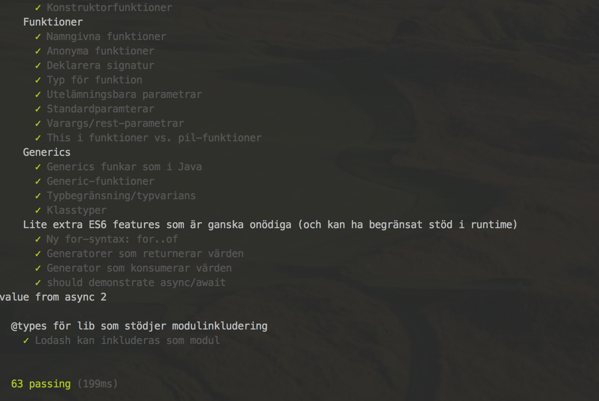

Kompetensdag: Typescript
========================

Här finns [Presentationen](https://docs.google.com/presentation/d/1pTQ3ZHSBVt503FDOa0TT1qQk7EACHghn3js7FkKo_74/edit?usp=sharing).

Förutsättning: Node JS 6.x är installerat (har inte testat på 7.x men det bör funka).

Kolla att projektet bygger (på mac eller *nix)
----------------------------------------------

```bash
$ cd typescript-language
$ npm install && npm run test
```
Då skall det rassla en massa installationer och köras tester 
vilket förhoppningsvis avslutas med följande:


