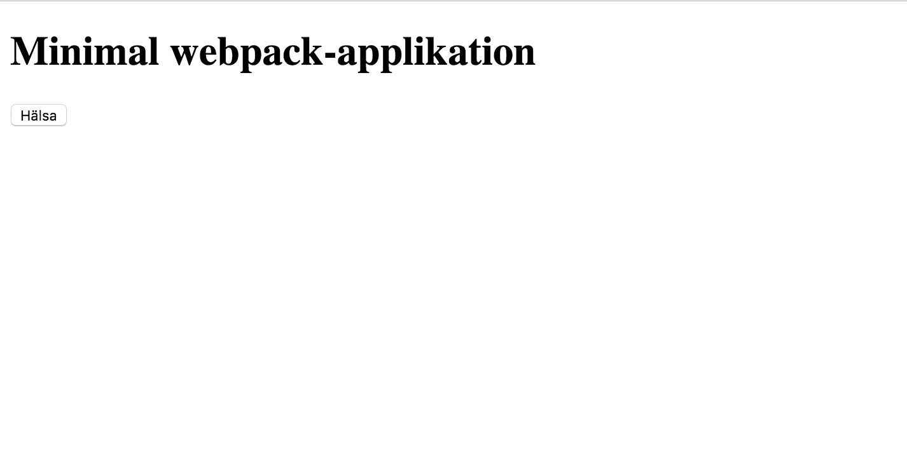

Använda webpack som mudulladare och utvecklingsmiljö
====================================================
[Webpack](https://github.com/webpack/webpack) är en modulpaketerare (byggfasen) och modulladdare (i runtime).

Det finns även andra modulladare

- [SystemJS](https://github.com/systemjs/systemjs)
- [RequireJS](http://requirejs.org/)
- [JSPM](http://jspm.io/)

Men webpack ser ut vara vinnaren i utvecklingsaktivitet, funktioner, plugins och enkelhet.

Vi skall sätta upp ett webpack-projekt för att få ett grepp om vad som erbjuds.

Sätta upp ett enkelt webpack-projekt för typescript-applikationer
-----------------------------------------------------------------
### Skapa projekt och installera paket

Först sätter vi upp ett node-projekt
  
    $ npm init -y
   
Sen installerar vi typescript, webpack samt lite webpack-tillägg:

    $ npm i -D rimraf                         # OS-oberoende rm -rf
    $ npm i -D typescript                     # TS-kompilatorn
    $ npm i -D webpack                        # Webpack-core
    $ npm i -D webpack-dev-server             # En utvecklingsserver för webpack, med hot reload
    $ npm i -D webpack-merge                  # Används för att merga webpack-konfigurationer
    $ npm i -D awesome-typescript-loader      # Webpack-laddare för typescript-filer
    $ npm i -D html-loader                    # Webpack-laddare för html-filer
    $ npm i -D html-webpack-plugin            # Webpack-tillägg för att skapa html-fil som laddar webpack-bundle
    
### Webpackkonfiguration
Vi skapar konfigurationsfiler under `config/` för webpack

- En gemensam bas
- En för utveckling med utvecklingsserver
- En för att bygga distro

#### Gemensam: config/webpack.common.js

Minimal, man behöver typiskt loders för CSS, LESS, SASS, m.m, det finns an uppsjö.

	const HtmlWebpackPlugin = require('html-webpack-plugin');
    module.exports = {
      entry: {
        // Här anger vi att huvudmodulen som skall inkluderas är src/Main.ts.
        // Denna skall sedan importera (direkt eller indirekt) resten av applikationen
        "main": "./src/Main.ts"
      },
      resolve: {
        // Webpack skall följande filändelser för att lösa upp moduler
        extensions: ['', '.ts', '.js']
      },
      module: {
        loaders: [
          {
            // Ange att awesome-typescript-loader skall användas för att ladda typescriptfiler
            // vid undling. Den kommer då att kompilera coh skapa source-maps m.m
            test: /\.ts$/,
            loader: "awesome-typescript-loader"
          },
          {
            // Ange loader för html-filer
            test: /\.html$/,
            loader: 'html'
          },
        ]
      },
      plugins: [
        // Definiera att html-webpack-plugin skall processa index.html, m.a.p filnamn
        new HtmlWebpackPlugin({
          template: 'src/index.html'
        })
      ]
    };

#### Specifik för utveckling : config/webpack.dev.js

    const webpackMerge = require('webpack-merge');
    const commonConfig = require('./webpack.common.js');

    // Här använder vi webpack-merge för att inkludera gemensam konf:
    module.exports = webpackMerge(commonConfig, {
      // Ange att vi skapar source maps med en metod som är lite snabbare än full source maps
      devtool: 'cheap-module-eval-source-map',

      // Devserver kommer att generera allt i minnet ist.f till disk
      output: {
        // Ange URL relativt vilken script m.m servas från
        publicPath: 'http://localhost:8080/'
      },

      // Lite konf för webpack devserver
      devServer: {
        historyApiFallback: true,
        stats: 'minimal'
      }
    });

#### Specifik för distro : config/webpack.prod.js

Denna är minimal, här lägger man typiskt till tillägg för uglifiering, m.m

    const webpack = require('webpack');
    const webpackMerge = require('webpack-merge');
    const commonConfig = require('./webpack.common.js');

    module.exports = webpackMerge(commonConfig, {
      devtool: 'source-map',

      output: {
        path: 'dist',
        publicPath: '/',
        filename: '[name].[hash].js',
        chunkFilename: '[id].[hash].chunk.js'
      },

      htmlLoader: {
        minimize: false // workaround for ng2
      },

      plugins: [
        // Ta bort eventuell duplicering
        new webpack.optimize.DedupePlugin()
      ]
    });

### Kommandon
Nu när vi har olika webpack-konfar så vill vi kunna köra dem. Vi behöver inte grunt eller gulp utan kan skapa
os enkla script i package.json.

Vi lägger till följande under "scripts"-avdelningen i package.json     

Kommando för att starta utvecklingsservern med automatiskt ombygge vid ändringar (använder config/webpack.dev.js):

    :
    "start": "node_modules/.bin/webpack-dev-server --config config/webpack.dev.js --inline --progress --port 8080",
    :
    
Kommando för att bygga distro under `dist/` (config/webpack.prod.js):

    :
    "build:prod": "node_modules/.bin/rimraf ./dist && node_modules/.bin/webpack --config config/webpack.prod.js --progress --profile --bail",
    :

### Applikationens ingång: Main.ts & index.html

Vi skapar de angivna filerna + ett internt beroende för att se att importer funkar som de skall.

#### src/index.html

    <!DOCTYPE html>
    <html lang="sv">
      <head>
        <meta charset="UTF-8">
        <title>CAG-labs</title>
      </head>
      <body>
        <h1>Minimal webpack-applikation</h1>
        <button id="greetButton">Hälsa</button>
        

      </body>
    </html>

#### src/Main.ts

    import {Greeter} from "./greeter/Greeter";

    console.log('Loaded');

    const greeter = new Greeter();

#### src/greeter/Greeter.ts

    export class Greeter {
      private n = 0;
      constructor() {
        document.getElementById("greetButton").addEventListener("click", () => this.sayHi());
      }

      sayHi() {
        this.n++;
        if (this.n > 5) {
          document.getElementById("greeting").innerHTML = "Börjar bli lite tjatigt nu va?";
        } else {
          document.getElementById("greeting").innerHTML = document.getElementById("greeting").innerHTML+" Yo mannen!";
        }
      }
    }

Kör!
----

Nu är allt klart för att köra applikationen i utvecklingsservern.

Starta med

    $ npm start

Gå sedan till [http://localhost:8080](http://localhost:8080), så skall du se:

---
Prova att trycka på "Hälsa"-knappen så skall det dyka upp lite "Yo mannen!"-rader.

Prova att ändra koden, t.ex "Yo mannen"-hälsningsfrasen i Greeting.ts; filerna kompileras om direkt och browsern
uppdateras auomatiskt.

Bygg distro
-----------
När man skall bygga en distro kör man 

    $ npm run build:prod
    
Den körbara applikationen (som t.ex kan inkluderas i en WAR-fil eller deployas direkt på Apacche, NGINX, e.dyl) finns under `dist/`. 

Vi kan testa genom att köra en [lite-sever](https://github.com/johnpapa/lite-server):

	$ npm i -g lite-server
	$ cd dist
	$ lite-server
	
Lite server öppnar automatiskt [http://localhost:3000/](http://localhost:3000/) och där ska vi se våran applikation nu servad från `dist/`.	  

